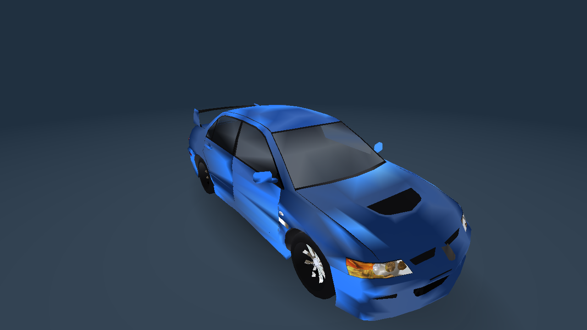
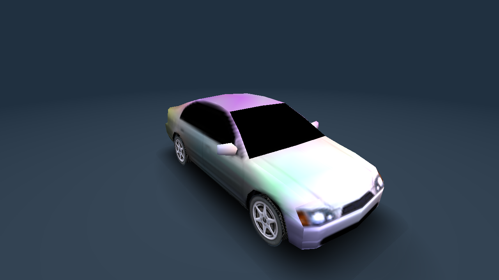
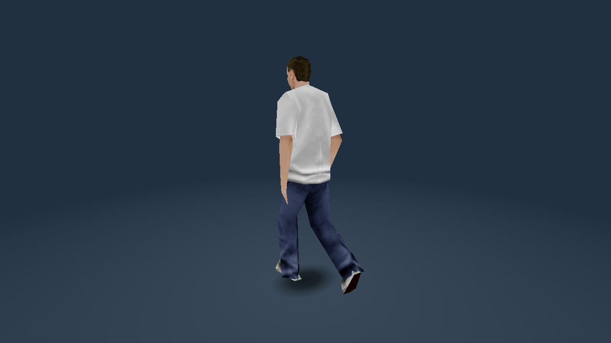
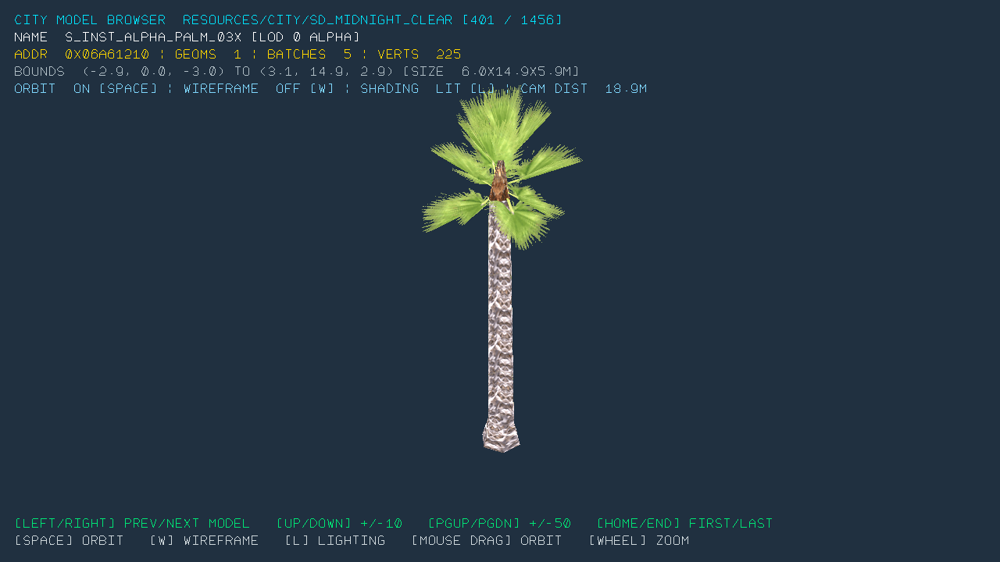
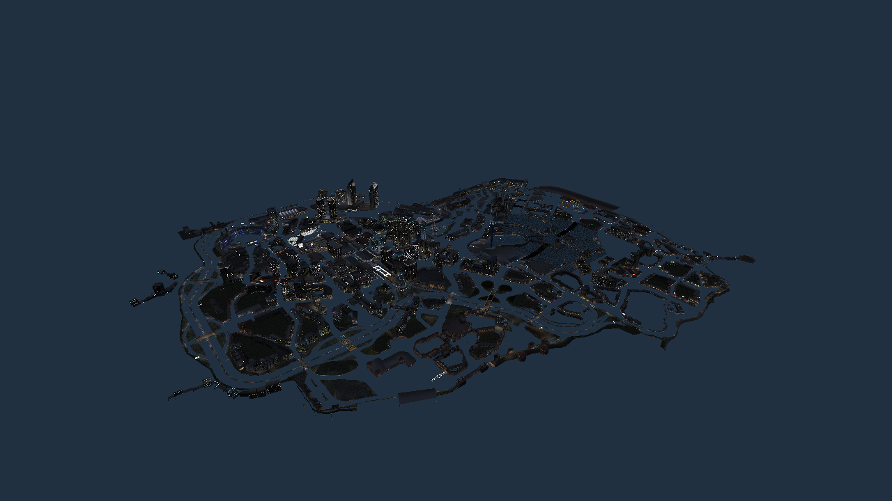
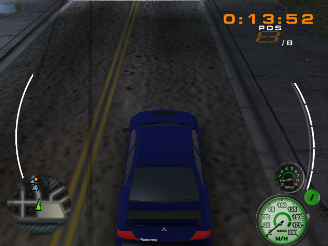

# rscview

A viewer for Midnight Club 3 (PS2, DUB Edition / Remix) resource packs on PC. It loads a
console `.pck`, decodes the rmcModel VIF geometry and PSMT8 page textures, and draws cars,
city models, ambient traffic vehicles and pedestrians under an orbit camera through a
Direct3D 11 backend.

No game data is included. You supply it from your own disc.

## What it looks like

A vehicle, assembled from its parts with paint and light lenses.



An ambient traffic vehicle.



A pedestrian, skinned and animated from the game's own clips.



The city model browser: one model at a time out of a city pack, with its bounds and shader
range.



The whole city at once, built through the game's own resource builder and drawn as a single
object - every placed model, no streaming.



The same engine running the game itself in a race, with the HUD: clock, position, the zone
and turbo/nitro arcs, tachometer, speedometer and mini-map.



## Run

Copy `rscview.exe` into the game's data folder - the disc contents, `ASSETS.DAT` and the
rest, as they come off the ISO - and run it from there with no path:

```
rscview -car vp_lancer_04 -width 1280 -height 720
rscview -ambient va_civic_sh
rscview -ped [name|index] [-city sd] [-anim walk]
rscview -city sandiego
rscview -pack resources/city/sd_midnight_clear [-model n | -models first count] [-list]
rscview -pack resources/city/sd_midnight_clear -loadcity        the whole city at once
```

It looks for the data beside the executable first and then in the working directory,
recognising the folder by `ASSETS.DAT`, and mounts `ASSETS.DAT`, `TEXTURE.DAT` and
`BANKS.DAT` to read resources straight out of them. Nothing has to be unpacked.

A loose asset tree works too, if you already have one: pass `-path <dir>` and the same
commands apply. An explicit `-path` always wins over the search above, and `-archive
<name>[;<name>...]` names the archives to mount instead of the default set.

`-loadcity` builds the city through the game's own resource builder and draws all of it as a
single object - every placed model, no streaming. `-citydist N` sets how far it draws.

The `view*.bat` launchers (`viewcar`, `viewambient`, `viewcity`, `viewcityall`, `viewped`)
run `bin\rscview.exe` from any directory. They take the game data from `RSCVIEW_ASSETS` (the
folder holding `ASSETS.DAT`, or a loose asset tree), else `assets_unpacked\` or `assets\` next
to the scripts, else `bin\`, else the current directory, and say what to set when they find
none:

```
set RSCVIEW_ASSETS=D:\MC3
viewcar vp_lancer_04
```

### Controls

Left/Right steps through models, Up/Down by ten, PageUp/PageDown by fifty, Home/End to the
ends. Space toggles orbit, `W` wireframe, `L` lighting. Drag with the left mouse button to
orbit, wheel to zoom.

`-shot out.png -shotframes N` saves a screenshot and exits; `-nogfx` runs headless. The full
flag list is in the header comment of `age/src/rscview/rscview.cpp`.

## Build

Needs Visual Studio 2019+ with the C++ x64 tools (the script finds it with vswhere).

```
build.bat              debug-info build   -> bin\rscview.exe
build.bat /release     /O2                -> bin\rscview_release.exe
build.bat /clean       rebuild everything
build.bat /includes    list every header the sources include (obj\debug\includes.txt)
```

Builds are incremental per directory: a directory recompiles when one of its `.cpp` files is
newer than its object, and a configuration starts over when its compiler flags change. It
does not track header dependencies, so after editing a header use `/clean` - otherwise a
build can report success while linking objects compiled from the old header.

The build fixes the configuration: `__WIN32PC`/`__D3D` on, every console off, `__BANK=0`
(no RAG widgets), `__DEV=1`, and `__USE_CRFANIMATION_LIB=1`.

## Layout

| Directory     | What                                                                  |
|---------------|-----------------------------------------------------------------------|
| `age/src`     | The engine: a PC/D3D11 implementation of the AGE API                  |
| `mc3/src`     | The Midnight Club 3 game code the viewer needs (city, peds, cars, ...) |
| `sources.txt` | The translation units that get compiled                               |

The roots keep their original names because includes use them: `#include "gfx/rgl.h"`
resolves against `age/src`, and `mcgfx/...` against `mc3/src`.

`sources.txt` is the build: `build.ps1` compiles each line in it and links
`bin\rscview.exe`. There is no other project file.
